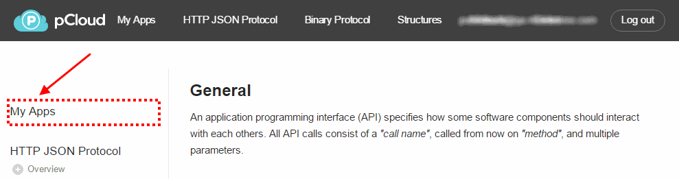
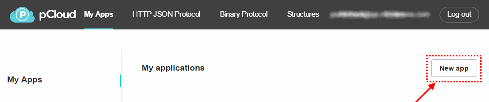
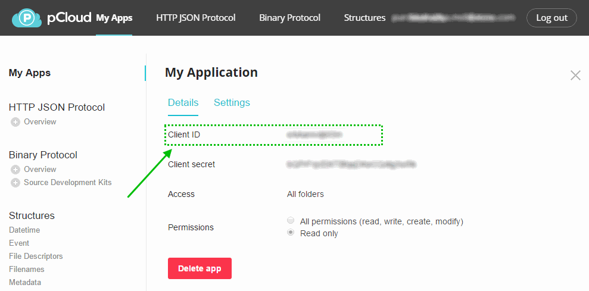
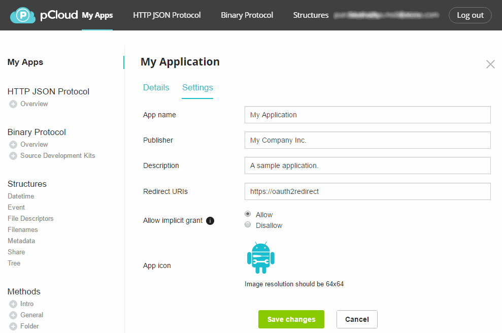

#  pCloud Java SDK

The official pCloud SDK for Java & Android for integrating with [ pCloud's API][docs].

## Requirements

- Java 7.0+
- Android 2.3+ (API9+)

## Documentation

- The documentation for the SDK can be found [here](https://pcloud.github.io/pcloud-sdk-java/).
- The pCloud API documentation can be found [here][docs].

## Getting started
### 1. Register your pCloud API application

  - Create an application in the [pCloud App Console](https://docs.pcloud.com/my_apps/).
<br/>
<br/>

  - Take note of the app key(client ID) of your application once you create it.
<br/>

### 2. Configure your pCloud API application

  - Add a publisher.
  - Add a description.
  - Add a redirect URI in the `Redirect URIs` field in your application configuration page.

  >The SDK allows users to provide multiple custom Uris or expects the `https://oauth2redirect` Uri to be added in the Application configuration page.

  - Optionally add an icon that will be displayed to users upon authorization requests.
  - Turn on the `Allow implicit grant` option.
  - Save the changes.
  <br/>

### 3. Install the SDK

#### Java

Download [the latest JAR][jar-java] or grab via Maven:

```xml
<dependency>
  <groupId>com.pcloud.sdk</groupId>
  <artifactId>java-core</artifactId>
  <version>1.0.1</version>
  <type>pom</type>
</dependency>
```
or Gradle:
```groovy
compile 'com.pcloud.sdk:java-core:1.0.1'
```
[ ](https://bintray.com/pcloud/pcloud-sdk/java-core/_latestVersion)

#### Android

In addition to the functionality provided by the `java-core` module, users can benfit from the Android-specific `android` module.
The module provides a built-in authorization Activity that handles the application authorization requests.
For details on usage, refer to the  [AuthorizationActivity](https://pcloud.github.io/pcloud-sdk-java/com/pcloud/sdk/AuthorizationActivity.html) documentation.


Download [the latest JAR][jar-android] or grab via Maven:

```xml
<dependency>
  <groupId>com.pcloud.sdk</groupId>
  <artifactId>android</artifactId>
  <version>1.0.1</version>
  <type>pom</type>
</dependency>
```
or Gradle:
```groovy
compile 'com.pcloud.sdk:android:1.0.1'
```
[ ](https://bintray.com/pcloud/pcloud-sdk/android/_latestVersion)


## Samples

### Java

See the code in the `sample` module or the sample application [here.](https://github.com/pCloud/pcloud-sdk-java/blob/master/sample/src/main/java/Main.java). The sample explains briefly:
- [ApiClient](https://pcloud.github.io/pcloud-sdk-java/com/pcloud/sdk/ApiClient.html) instantiation and configuration.
- File tree browsing and listing folder contents.
- Copy/move/delete/rename operations on files and folders.
- File uploads.
- File downloads.
- File download link generation.

### Android

- See the code in the `sample-android` module or the sample application [here](https://github.com/pCloud/pcloud-sdk-java/blob/master/sample-android/src/main/java/com/pcloud/sdk/sample/MainActivity.java).
- The sample contains an application allowing users to request authorization for a registered pCloud API application.
- The sample gives a hint on how [AuthorizationActivity](https://pcloud.github.io/pcloud-sdk-java/com/pcloud/sdk/AuthorizationActivity.html) should be used.

#License
	Licensed under the Apache License, Version 2.0 (the "License");
    you may not use this file except in compliance with the License.
    You may obtain a copy of the License at

       http://www.apache.org/licenses/LICENSE-2.0

    Unless required by applicable law or agreed to in writing, software
    distributed under the License is distributed on an "AS IS" BASIS,
    WITHOUT WARRANTIES OR CONDITIONS OF ANY KIND, either express or implied.
    See the License for the specific language governing permissions and
    limitations under the License.


[site]: https://www.pcloud.com/
[docs]: https://docs.pcloud.com/
[bintray]: https://bintray.com/pcloud/pcloud-sdk/
[jar-android]: https://bintray.com/pcloud/pcloud-sdk/download_file?file_path=com%2Fpcloud%2Fsdk%2Fandroid%2F1.0.1%2Fandroid-1.0.1.aar
[jar-java]: https://bintray.com/pcloud/pcloud-sdk/download_file?file_path=com%2Fpcloud%2Fsdk%2Fjava-core%2F1.0.1%2Fjava-core-1.0.1.jar

